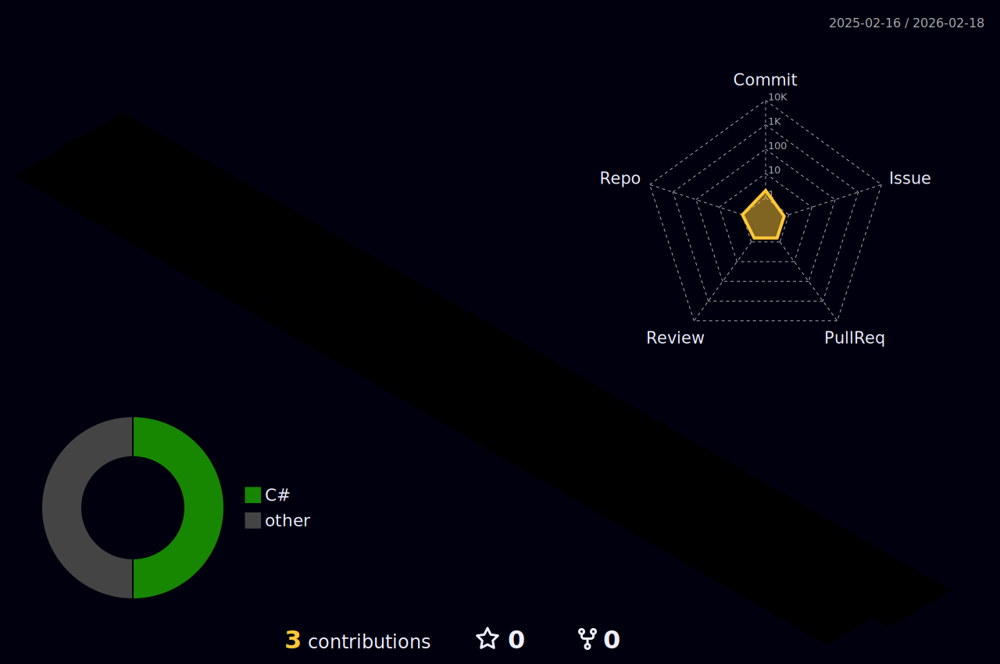

## Pedro Henrique Costa Sinezio - Freelancer Fullstack

Olá! Sou um desenvolvedor fullstack freelancer, especializado em criar aplicações web de alta performance e páginas front-end responsivas. Também tenho experiência no desenvolvimento de programas desktop utilizando Electron.

Sou proficiente em Python, Java, Angular, React, Next.js, Spring, Django e NestJS, além de possuir habilidades em Go e C. Se você está procurando um profissional para dar vida ao seu projeto, estou disponível para novas oportunidades no momento.

Se estiver interessado, sinta-se à vontade para entrar em contato pelos detalhes abaixo:

---

|  |  |
|-----------------------------------------------------------------------------------------------------------------------------------------------------------------------------------------------------|------------------------------------------------------------------------------------------------------------------------------------------------------------------------------------------------------|

---

