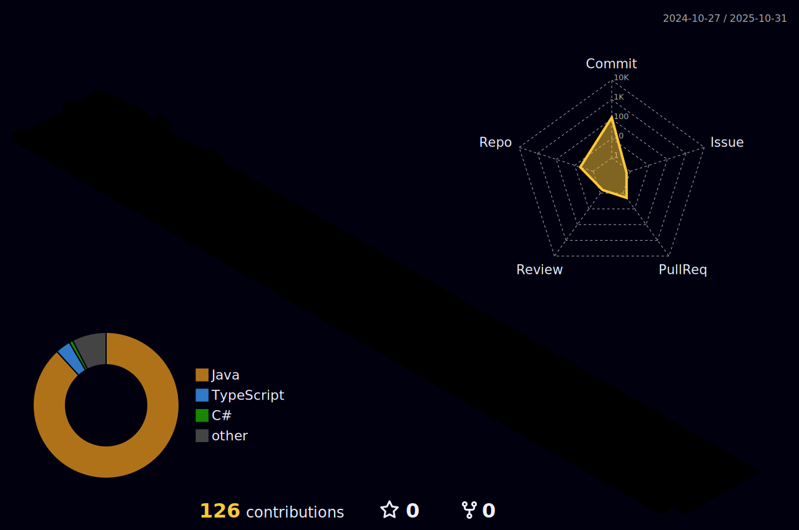

## Pedro Henrique Costa Sinezio - Fullstack Freelancer

Hello! I’m a fullstack freelancer specializing in building high-performance and responsive web applications and front-end pages. I also have experience developing desktop programs with Electron.

I’m proficient in Python, Java, Angular, React, Next.js, and NestJS, and I also have skills in Go and C. If you’re looking for a professional to bring your project to life, I’m currently available for new opportunities.

If you're interested, feel free to reach out via the contact details below:

---

|  |  |
|-----------------------------------------------------------------------------------------------------------------------------------------------------------------------------------------------------|------------------------------------------------------------------------------------------------------------------------------------------------------------------------------------------------------|

---

